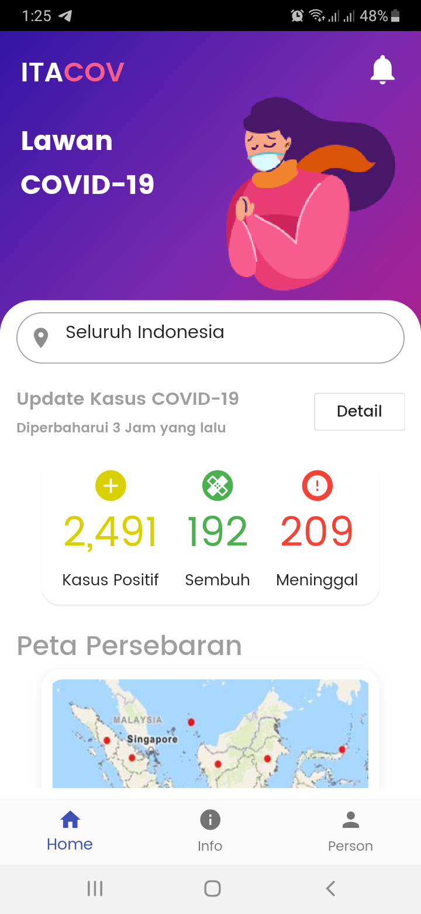
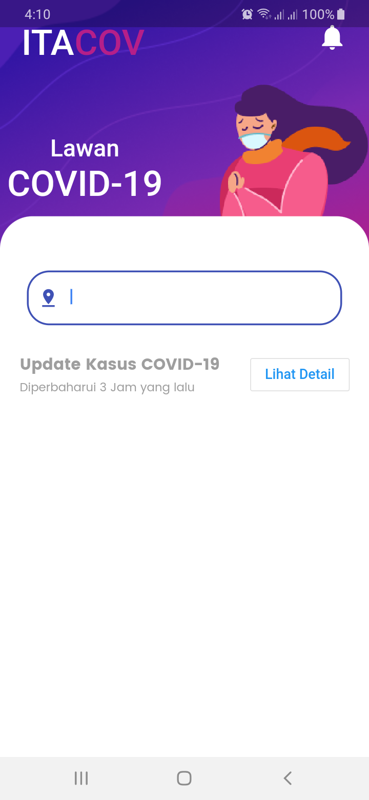

# ITACOV 🗺

Sebuah project aplikasi mobile open source made with flutter, di harapkan dapat membantu untuk mencegah penyebaran Covid-19 

## Mau Ikut ?
- [Design App](https://www.figma.com/file/zZdSbymxNepJGTjCe9pgP2/itacov?node-id=0%3A876)
- Sementara belum implementasi API, kalau ada yang punya refrensi, monggo,

## Kontributor
- [Mas Saladin | Designer](mailto:heysaladin@gmail.com)
- [Suku | Kuli Ngetik](mailto:ilzammulkhaq85@gmail.com)
- [Hanan | Budak Invoice](mailto:hasyrawi@gmail.com)
- [Roma]
- [Steven] 
## for Home Screen 

## for info page

## Link Trello

**[linktrelo](https://trello.com/invite/b/prPaFoco/6b7839d2f902ed0f3620f981d9391675/itacov)**

